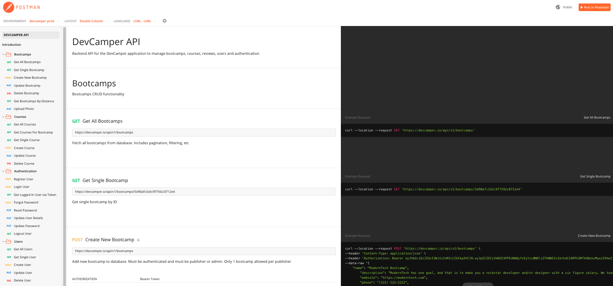

# DevCamper API

## Backend API for DevCamper application, which is a bootcamp directory website.

https://documenter.getpostman.com/view/8923145/SVtVVTzd?version=latest

## Tech Used
1. Authentication JWT
2. Express
3. MongoDb
4. NodeJs
5. Custom API with 32 endpoints

## Run Locally
Rename "config/config.env.env" to "config/config.env" and update the values/settings to your own
npm install
npm run dev

